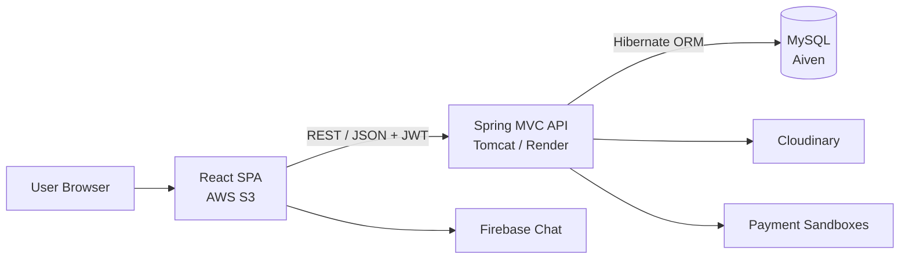

# Travel Booking System

[](https://github.com/dominhvuong2206/TravelBookingSystem/actions/workflows/ci.yml)


A full-stack travel marketplace that connects travelers with service providers. Customers can discover, compare, book, review, and pay for travel services; providers manage their listings and operations; administrators oversee users, categories, transactions, and business performance.

## Live Demo

| Application | URL | Status |
|---|---|---|
| React frontend | [AWS S3 website](http://travel-booking-dmv.s3-website-ap-southeast-1.amazonaws.com/) | Online |
| REST API | [Render web service](https://travel-booking-backend-f6og.onrender.com/TravelBookingSystem/api/categories) | Online |

> The backend uses a free Render instance and may spin down after a period of inactivity. The first request after an idle period can take up to a minute while the service starts.

## Project Highlights

- Role-based workflows for customers, service providers, and administrators.
- JWT authentication, BCrypt password hashing, protected REST endpoints, and role-based authorization.
- Full booking lifecycle with availability tracking, confirmation, cancellation, and payment status management.
- Search, filtering, pagination, reviews, rating summaries, and side-by-side service comparison.
- Provider and administrator dashboards with revenue and booking analytics.
- Real-time customer-provider chat powered by Firebase.
- Cloudinary image uploads and sandbox integrations for Stripe, PayPal, MoMo, and ZaloPay.
- Decoupled React and Spring MVC architecture backed by Hibernate ORM and MySQL.
- Multi-stage Docker build and automated frontend/backend verification with GitHub Actions.

## Features by Role

### Customer

- Register, sign in, and manage a personal profile.
- Browse, search, filter, and compare travel services.
- View service details, availability, ratings, and reviews.
- Create bookings, view booking history, and cancel eligible bookings.
- Review completed services and view payment history.
- Use configured sandbox payment gateways.
- Chat with a provider about a service or booking.

### Service Provider

- Create, update, activate, deactivate, and delete travel services.
- Upload service images through Cloudinary.
- Review bookings for each owned service.
- Confirm or cancel bookings and update payment status.
- View customer feedback and post provider replies.
- Monitor revenue, booking performance, and payment history.

### Administrator

- View platform-level summary, revenue, and booking analytics.
- Browse users, control account activation, and approve providers.
- Create, update, activate, and deactivate service categories.
- Review platform-wide payment transactions and update payment status.

## Architecture

The project uses a decoupled client-server architecture. The React single-page application communicates with the backend through REST APIs, while the backend follows a layered Spring MVC design.



Backend request flow:

```text
HTTP Request
    -> Security / JWT Filter
    -> Controller
    -> Service
    -> Repository
    -> Hibernate
    -> MySQL
```

## Technology Stack

| Area | Technologies |
|---|---|
| Frontend | React 19, React Router 6, React Bootstrap, Axios, Chart.js |
| Backend | Java 17, Spring MVC 6, Spring Security 6, Hibernate ORM 6 |
| Database | MySQL 8, utf8mb4 |
| Authentication | JWT with Nimbus JOSE + JWT, BCrypt |
| Media and chat | Cloudinary, Firebase |
| Payments | Stripe, PayPal, MoMo, ZaloPay sandbox APIs |
| Testing | JUnit 5, Jest, React Testing Library |
| Build and runtime | Maven, npm, Docker, Tomcat 10 |
| CI/CD and hosting | GitHub Actions, AWS S3, Render, Aiven MySQL |

## Repository Structure

```text
TravelBookingSystem/
|-- .github/workflows/ci.yml       # Automated frontend and backend checks
|-- travel-booking-backend/        # Spring MVC REST API packaged as a WAR
|   |-- src/main/java/com/dmv/
|   |   |-- configs/               # Spring, Hibernate, security, and integrations
|   |   |-- controllers/           # Public, customer, provider, admin, payment APIs
|   |   |-- filters/               # JWT authentication filter
|   |   |-- pojo/                  # Hibernate entities
|   |   |-- repository/            # Persistence layer
|   |   |-- service/               # Business logic
|   |   `-- utils/                 # Shared utilities
|   |-- src/test/                  # Backend unit tests
|   |-- .env.example               # Backend environment variable template
|   |-- Dockerfile                 # Maven build and Tomcat runtime image
|   `-- pom.xml
|-- travel-booking-frontend/       # React single-page application
|   |-- public/
|   |-- src/
|   |   |-- components/            # Shared UI, routing, charts, and chat
|   |   |-- configs/               # API, Firebase, and context configuration
|   |   |-- reducers/              # Context and reducer state management
|   |   |-- screens/               # Customer, provider, and admin pages
|   |   |-- services/              # Firebase chat service
|   |   `-- utils/                 # Authentication and date helpers
|   |-- .env.example               # Frontend environment variable template
|   `-- package.json
|-- travelbookingdb.sql            # Database schema and base data
`-- seed-travel-sample-data.sql    # Portfolio demonstration data
```

## Getting Started

### Prerequisites

- Java Development Kit 17+
- Maven 3.9+
- Node.js 20+ and npm
- MySQL 8+
- Tomcat 10.1+ or Docker
- MySQL Workbench or the MySQL CLI

### 1. Clone the repository

```bash
git clone https://github.com/dominhvuong2206/TravelBookingSystem.git
cd TravelBookingSystem
```

### 2. Initialize the database

Import the schema first, followed by the demonstration data:

```bash
mysql -u root -p < travelbookingdb.sql
mysql -u root -p travelbookingdb < seed-travel-sample-data.sql
```

On Windows PowerShell, use MySQL Workbench or run the commands through `cmd.exe`:

```powershell
cmd /c "mysql -u root -p < travelbookingdb.sql"
cmd /c "mysql -u root -p travelbookingdb < seed-travel-sample-data.sql"
```

### 3. Configure the backend

Use [`travel-booking-backend/.env.example`](travel-booking-backend/.env.example) as the variable reference. The application reads the process environment; it does not automatically load a `.env` file when launched directly with Maven or Tomcat.

Minimum local PowerShell configuration:

```powershell
$env:MYSQLHOST="localhost"
$env:MYSQLPORT="3306"
$env:MYSQLDATABASE="travelbookingdb"
$env:MYSQLUSER="root"
$env:MYSQLPASSWORD="your-mysql-password"
$env:JWT_SECRET="replace-with-a-random-secret-of-at-least-32-bytes"
$env:JWT_EXPIRATION_MS="86400000"
$env:FRONTEND_URL="http://localhost:3000"
$env:BACKEND_URL="http://localhost:8080/TravelBookingSystem"
$env:CORS_ALLOWED_ORIGINS="http://localhost:3000"
```

Cloudinary and payment variables are optional unless their related features are being tested.

### 4. Build and run the backend

#### Option A: Tomcat

```bash
cd travel-booking-backend
mvn clean verify
```

Deploy `target/travel-booking-backend-1.0-SNAPSHOT.war` to Tomcat 10.1. Rename it to `TravelBookingSystem.war` when copying it into Tomcat's `webapps` directory.

```text
http://localhost:8080/TravelBookingSystem
```

#### Option B: Docker

Create `travel-booking-backend/.env` from the example. When MySQL runs on the host machine, set:

```dotenv
HIBERNATE_CONNECTION_URL=jdbc:mysql://host.docker.internal:3306/travelbookingdb?useUnicode=true&characterEncoding=UTF-8&allowPublicKeyRetrieval=true&useSSL=false&serverTimezone=UTC
```

Then build and start the container:

```bash
cd travel-booking-backend
docker build -t travel-booking-backend .
docker run --rm --env-file .env -p 8080:8080 travel-booking-backend
```

### 5. Configure and run the frontend

```powershell
cd travel-booking-frontend
Copy-Item .env.example .env
npm ci
npm start
```

The frontend runs at `http://localhost:3000`. Its default API configuration is:

```dotenv
REACT_APP_API_BASE_URL=http://localhost:8080/TravelBookingSystem/api/
```

## Environment Variables

### Backend core variables

| Variable | Required | Description |
|---|---:|---|
| `HIBERNATE_CONNECTION_URL` | Production | Complete JDBC URL; recommended for hosted databases and TLS configuration |
| `MYSQLHOST` | Local fallback | MySQL hostname |
| `MYSQLPORT` | Local fallback | MySQL port |
| `MYSQLDATABASE` | Local fallback | Database name |
| `MYSQLUSER` | Yes | Database username |
| `MYSQLPASSWORD` | Yes | Database password |
| `JWT_SECRET` | Yes | JWT signing secret with at least 32 UTF-8 bytes |
| `JWT_EXPIRATION_MS` | No | Token lifetime in milliseconds; defaults to `86400000` |
| `FRONTEND_URL` | Yes | Public frontend URL used for redirects and CORS fallback |
| `BACKEND_URL` | Production | Public backend context URL used by payment callbacks |
| `CORS_ALLOWED_ORIGINS` | Yes | Comma-separated list of allowed frontend origins |

### Optional integrations

| Integration | Variables |
|---|---|
| Cloudinary | `CLOUDINARY_CLOUD_NAME`, `CLOUDINARY_API_KEY`, `CLOUDINARY_API_SECRET` |
| Stripe | `STRIPE_SECRET_KEY` |
| PayPal | `PAYPAL_CLIENT_ID`, `PAYPAL_CLIENT_SECRET` |
| MoMo | `MOMO_PARTNER_CODE`, `MOMO_ACCESS_KEY`, `MOMO_SECRET_KEY` |
| ZaloPay | `ZALOPAY_APP_ID`, `ZALOPAY_KEY1`, `ZALOPAY_KEY2` |

Frontend uses `REACT_APP_API_BASE_URL`, which must include the `/api/` suffix.

> Never commit production credentials. Use environment variables or the secret-management feature provided by the hosting platform.

## API Overview

The local API root is `http://localhost:8080/TravelBookingSystem/api`.

### Public and authentication routes

| Method | Route | Description |
|---|---|---|
| `POST` | `/api/users` | Register a customer or provider account |
| `POST` | `/api/login` | Authenticate and receive a JWT |
| `GET` | `/api/categories` | List active service categories |
| `GET` | `/api/services` | Search and paginate travel services |
| `GET` | `/api/services/{serviceId}` | Get service details |
| `GET` | `/api/services/{serviceId}/reviews` | List service reviews |
| `GET` | `/api/services/{serviceId}/rating-summary` | Get aggregate rating data |

### Protected route groups

| Route group | Access | Purpose |
|---|---|---|
| `/api/secure/profile` | Authenticated | View and update the current profile |
| `/api/secure/bookings/**` | Customer | Create, list, view, and cancel bookings |
| `/api/secure/payments/**` | Customer | Payment history and payment operations |
| `/api/secure/provider/**` | Provider | Service, booking, review, payment, and analytics management |
| `/api/secure/admin/**` | Administrator | User, category, payment, and analytics administration |

Protected requests use `Authorization: Bearer <jwt-token>`.

## Demo Accounts

| Username | Password | Role |
|---|---|---|
| `admin` | `Admin@123` | Administrator |
| `provider` | `Provider@123` | Service provider |
| `customer` | `Customer@123` | Customer |

> These credentials are only for local development and a public portfolio demo. Replace or disable them before using the project in a real production environment.

## Testing and Quality Checks

Backend verification:

```bash
cd travel-booking-backend
mvn clean verify
```

Frontend tests and production build:

```bash
cd travel-booking-frontend
npm ci
npm test -- --watchAll=false
npm run build
```

GitHub Actions runs the same backend verification, frontend tests, and production build for pull requests and pushes to `main`.

## Production Deployment

The live portfolio deployment is:

```text
React frontend  -> AWS S3 static website hosting
Spring MVC API  -> Render Docker web service
MySQL database  -> Aiven for MySQL
```

### Backend on Render

```text
Service type:          Web Service
Runtime:               Docker
Branch:                main
Root directory:        travel-booking-backend
Dockerfile path:       ./Dockerfile
Health check path:     /TravelBookingSystem/api/categories
```

For Aiven, provide a TLS-enabled database URL:

```dotenv
HIBERNATE_CONNECTION_URL=jdbc:mysql://<HOST>:<PORT>/travelbookingdb?sslMode=REQUIRED&useUnicode=true&characterEncoding=UTF-8&serverTimezone=UTC
```

The deployed API URL includes the WAR context path:

```text
https://travel-booking-backend-f6og.onrender.com/TravelBookingSystem/api/
```

### Frontend on AWS S3

Create `travel-booking-frontend/.env.production`:

```dotenv
REACT_APP_API_BASE_URL=https://travel-booking-backend-f6og.onrender.com/TravelBookingSystem/api/
```

Build and upload the static application:

```bash
cd travel-booking-frontend
npm ci
npm run build
aws s3 sync build/ s3://travel-booking-dmv/ --delete
```

## Security Notes

- JWT signing fails fast when `JWT_SECRET` is missing or shorter than 32 bytes.
- Passwords are stored using BCrypt rather than plain text.
- Customer, provider, and administrator endpoints are protected independently.
- CORS origins are controlled through environment configuration.
- Secrets belong in the deployment platform's secret store and must never be committed.
- Payment credentials should use sandbox accounts for portfolio demonstrations.

## Author

**Do Minh Vuong**

- GitHub: [github.com/dominhvuong2206](https://github.com/dominhvuong2206)
- LinkedIn: [linkedin.com/in/dominhvuong2206](https://www.linkedin.com/in/dominhvuong2206)

This project was developed as a full-stack software engineering portfolio project, with an emphasis on layered architecture, REST API design, authentication, role-based workflows, third-party integrations, testing, and cloud deployment.
